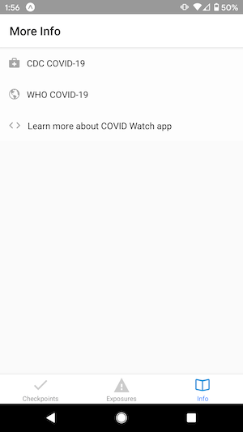

# covidwatch-app (COVID Watch P2P)

- [Private](#Private)
- [Peer to Peer](#Peer-to-Peer)

## Private

Privacy was a primary objective in the development of this application. By design, no personally identifiable information is collected or stored. The app does not utilize any names, ages, locations, email addresses, or any other identifying information. There are no user accounts or registration involved. Only minimal data for app functionality is utilized or stored, and it is never associated with your identity. Essentially, the only information that is collected and used is an abstract graph of nodes ("checkpoints") connected by edges (each edge represents a movement of an anonymous person from one checkpoint to the next). On the mobile application, but not the server itself, each checkpoint is additionally associated with a timestamp.

This app requests camera permission for scanning QR codes, but does not request any additional permissions. It does not process or use any location data. At the cost of a more user-friendly interface, your device does *not* store information regarding whether you have reported positive status through the app. Reporting positive status through the app is therefore done anonymously and cannot be traced back to you, even if your device data is compromised. As with any application, there are always privacy risks and concerns which can never be completely eliminated. However, this application was built to minimize the possibility of a privacy breach, even in the case of unforeseen scenarios such as bugs in the mobile application or compromise of server data. By completely avoiding the use of personal data such as name and location, the risk of privacy invasion is minimal.

Additionally, please refer to the app [privacy policy](PRIVACY.md).

## Peer-to-Peer

This app is not peer-to-peer (P2P) in the strict computational sense of the word, in that at the architecture level there is a centralized sever to facility efficient and reliable transfer of information between devices. However, the server acts only as a data store and only stores a bare minimum of information for app functionality. The server can only see abstract nodes and edges and does not store any device information in its database.

The app is, however, peer-to-peer in the social sense. It relies on peers working together to create checkpoints and honestly report their infection status. It is based on a system of coordination, face-to-face interaction, and trust.

## Screenshots

